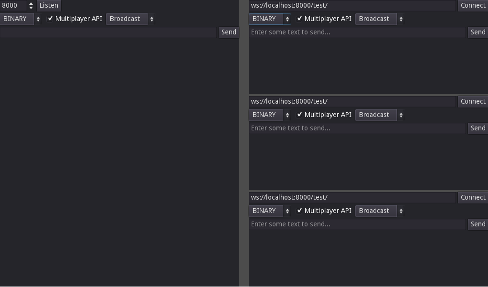

# WebSocket Chat

This is a demo of a simple chat implemented using WebSockets, showing both how to host a websocket server from Godot and how to connect to it.

Language: GDScript

Renderer: Compatibility

Check out this demo on the asset library: https://godotengine.org/asset-library/asset/2799

## Screenshots

