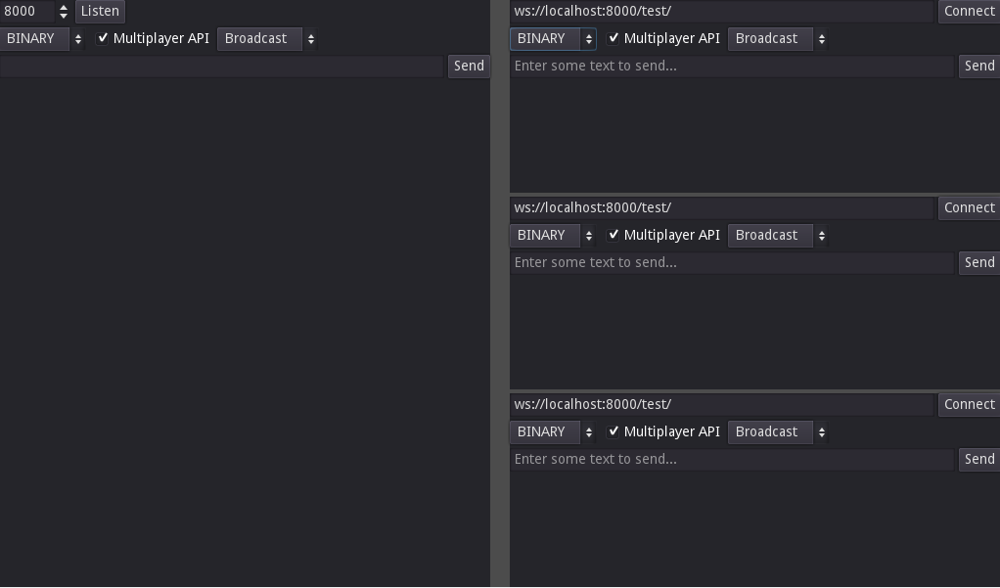

# WebSocket Chat

This is a demo of a simple chat implemented using WebSockets, showing both how to host a websocket server from Godot and how to connect to it.

Language: GDScript

Renderer: Compatibility

Check out this demo on the Asset Store: https://store.godotengine.org/asset/godot-foundation/websocket-chat-demo/

## Screenshots

