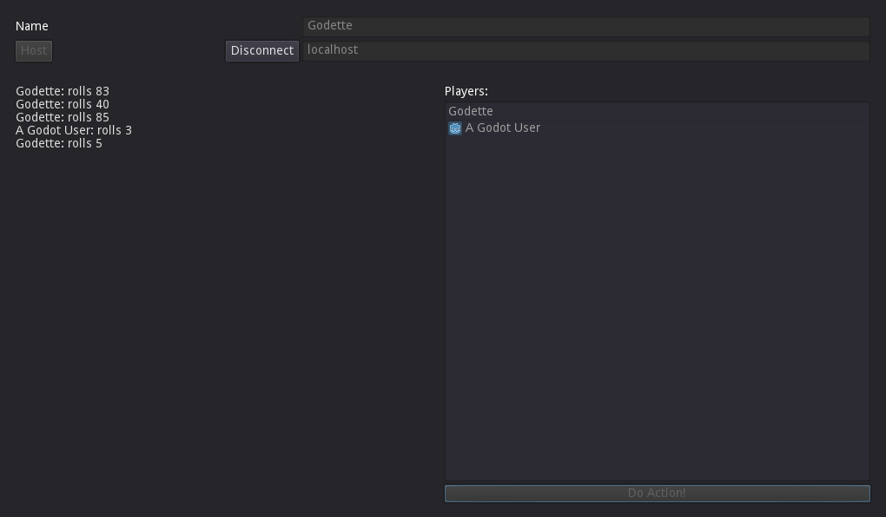

# WebSocket Multiplayer

This is a sample showing how the use WebSockets along with the Multiplayer API in Godot.

Language: GDScript

Renderer: Compatibility

Check out this demo on the asset library: https://godotengine.org/asset-library/asset/2801

## Screenshots

