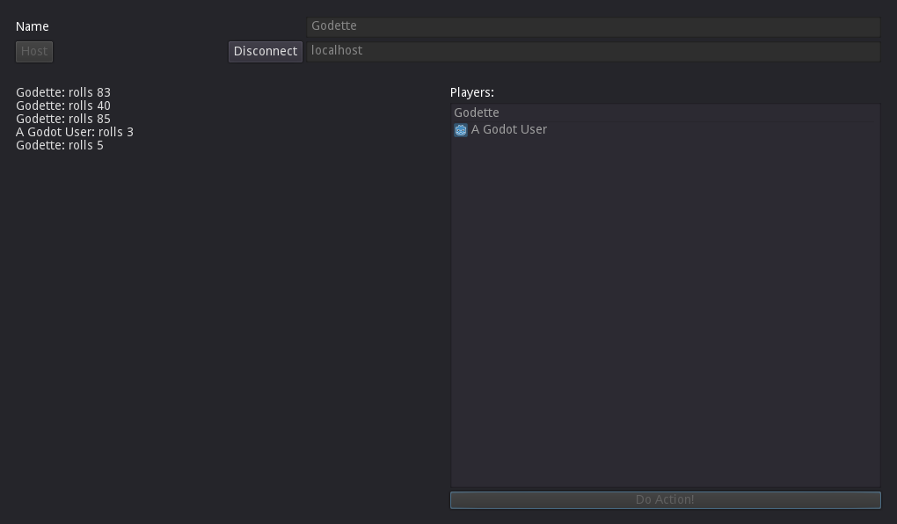

# WebSocket Multiplayer

This is a sample showing how the use WebSockets along with the Multiplayer API in Godot.

Language: GDScript

Renderer: Compatibility

Check out this demo on the Asset Store: https://store.godotengine.org/asset/godot-foundation/websocket-multiplayer-demo/

## Screenshots

