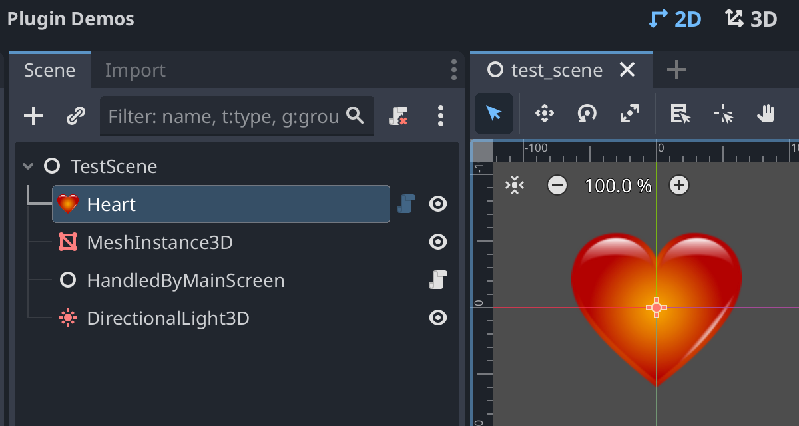
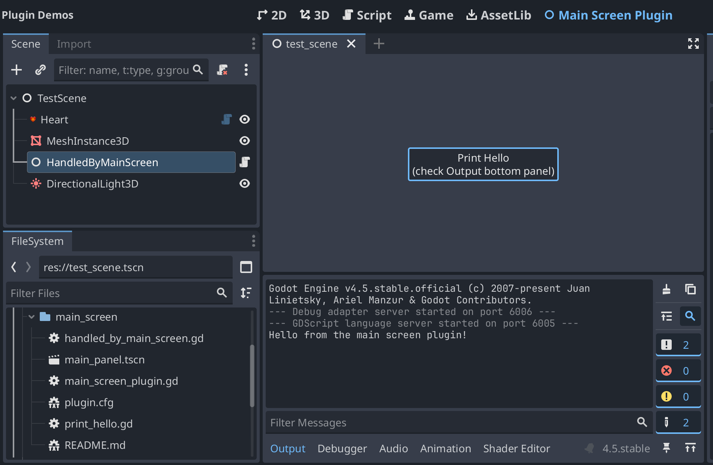
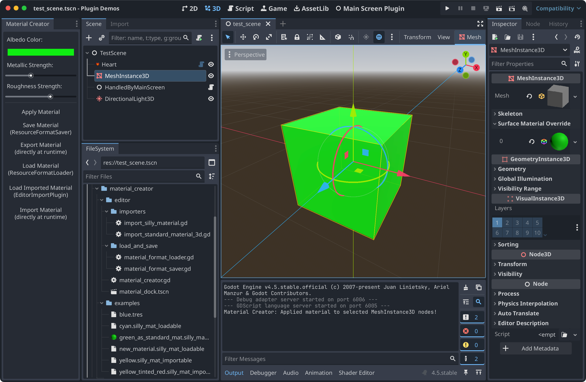
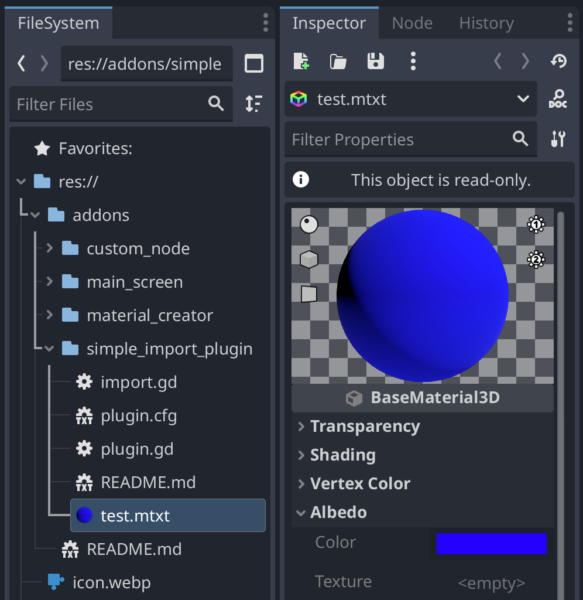

# Plugin Demos

This contains multiple plugin demos, all placed in a project for convenience.

Due to [issue #36713](https://github.com/godotengine/godot/issues/36713),
you need to open the project to import the assets once, then close, then open.

See the [documentation on editor plugins](https://docs.godotengine.org/en/latest/tutorials/plugins/editor/index.html)
for more information.

Language: GDScript

Renderer: Compatibility

Check out this demo on the asset library: https://godotengine.org/asset-library/asset/2802

# How does it work?

This project contains 4 plugins:

* The custom node plugin shows how to create a custom node type
  using `add_custom_type`. [More info](addons/custom_node).

* The main screen plugin is a minimal example of how to create a plugin
  with a main screen. [More info](addons/main_screen).

* The material creator plugin shows how to add a custom dock with some
  simple functionality, and shows how to create a custom Resource type
  with custom loading, saving, importing, and exporting logic,
  including editor integrations. [More info](addons/material_creator).

* The simple import plugin shows how to make a simple plugin handle importing
  a custom file type (mtxt). [More info](addons/simple_import_plugin).

To use these plugins in another project, copy any of these
folders to the `addons/` folder in a Godot project, and then
enable them in the project settings menu.

For example, the path would look like: `addons/custom_node`

Plugins can be distributed and installed from the UI.
If you make a ZIP archive that contains the folder, Godot will recognize
it as a plugin and will allow you to install it.

This can be done via the terminal: `zip -r custom_node.zip custom_node/*`

## Screenshots

