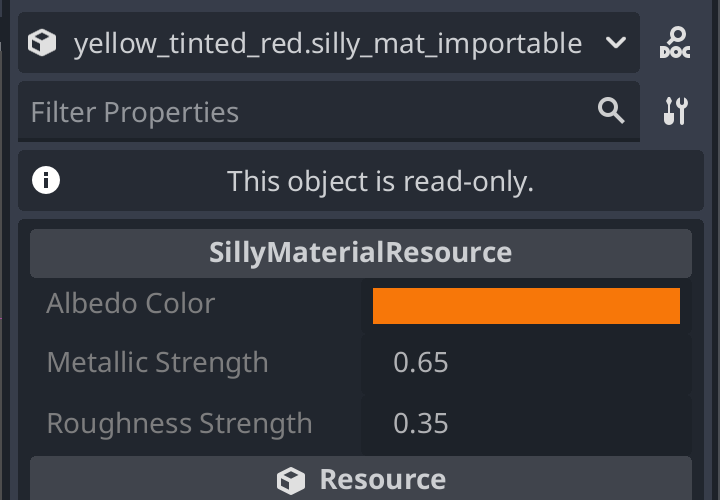
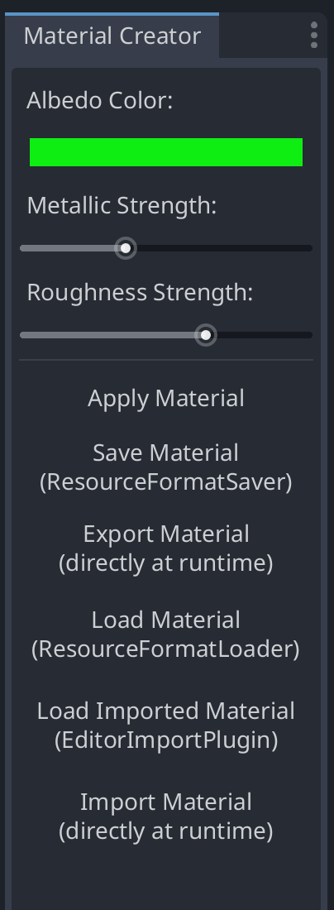

# Material Creator Plugin Demo

This plugin demo demonstrates these things:

- How to create a custom dock in the Godot editor with basic functionality.
  Custom docks are made of Control nodes, they run in the
  editor, and any behavior must be done through `@tool` scripts.
  For more information, see this documentation article:
  https://docs.godotengine.org/en/latest/tutorials/plugins/editor/making_plugins.html#a-custom-dock

- How to create a custom Resource type, and provide logic for
  serializing, deserializing, and converting this Resource type.

- Editor integration with classes for loading, saving, and importing
  this Resource type, including optional import customization.

For a more comprehensive example, see the GLTF module in Godot's source code.

For a less comprehensive example, see the "simple_import_plugin" folder.

## Importing vs Loading

The custom Resource type in this demo is supplemented by two different
sets of editor classes:

- [EditorImportPlugin](https://docs.godotengine.org/en/stable/classes/class_editorimportplugin.html)
  in the `importers/` folder, which allow customizing how
  files are imported into Godot as Resources of different
  types and optionally with import settings.
  Imported files have `.import` files generated next to them.

- [ResourceFormatLoader](https://docs.godotengine.org/en/stable/classes/class_resourceformatloader.html)
  and [ResourceFormatSaver](https://docs.godotengine.org/en/stable/classes/class_resourceformatsaver.html)
  in the `load_and_save/` folder, which allow easily
  editing files in the inspector and saving them back.
  Resource files have `.uid` files generated next to them.

These two approaches are mutually exclusive.
You may only use one approach at a time for a given file extension.
This demo showcases both by using 2 different file extensions.

In actual projects, you should either choose [EditorImportPlugin](https://docs.godotengine.org/en/stable/classes/class_editorimportplugin.html)(s)
for a configurable import, OR [ResourceFormatLoader](https://docs.godotengine.org/en/stable/classes/class_resourceformatloader.html)
for a writeable resource load.
The choice depends on if you treat the file as an external source asset
which should be imported and may be customized at import
([EditorImportPlugin](https://docs.godotengine.org/en/stable/classes/class_editorimportplugin.html)),
or if you treat the file as an internal Godot resource meant to be natively
and directly edited within Godot
([ResourceFormatLoader](https://docs.godotengine.org/en/stable/classes/class_resourceformatloader.html)).

For example, a glTF file may be generated by Blender, and therefore
is not intended to be edited directly in Godot, so it should use
[EditorImportPlugin](https://docs.godotengine.org/en/stable/classes/class_editorimportplugin.html).
Similarly, a PNG file is typically generated by an image editor, and Godot
needs to convert it to a different internal format, like a `.ctex` file
for a VRAM-compressed texture, so it should use
[EditorImportPlugin](https://docs.godotengine.org/en/stable/classes/class_editorimportplugin.html).
However, files like `.tres` and `.tscn` are Godot-native formats meant to be
edited directly in Godot, so they should use
[ResourceFormatLoader](https://docs.godotengine.org/en/stable/classes/class_resourceformatloader.html).

Once you choose one approach, create scripts deriving the appropriate classes,
override their callback functions, and register them in your plugin's
[`*_plugin.gd`](material_plugin.gd) script.

## Example Files

The [`examples/`](examples/) folder contains several example files:

- `blue.tres`: Directly saving a SillyMaterialResource using Godot's built-in `.tres` format,
  without any custom loader/saver logic or import/export logic, available for all Resource types.
  This can be edited in Godot's inspector and saved back.

- `cyan.silly_mat_loadable`: Storing a SillyMaterialResource as a custom format,
  such as via [ResourceFormatSaver](https://docs.godotengine.org/en/stable/classes/class_resourceformatsaver.html), which is loaded back using a custom [ResourceFormatLoader](https://docs.godotengine.org/en/stable/classes/class_resourceformatloader.html).
  This can be edited in Godot's inspector and saved back.

- `green_as_standard_mat.silly_mat_importable`: Storing a SillyMaterialResource as a custom format,
  which is imported as a StandardMaterial3D using custom import/export logic. This shows how
  importers can import files as any Resource type, converting custom files to data Godot can use.
  Imported files are read-only and cannot be edited in the inspector.

- `yellow.silly_mat_importable`: Storing a SillyMaterialResource as a custom format,
  which is imported as a SillyMaterialResource using custom import/export logic.
  Imported files are read-only and cannot be edited in the inspector.

- `yellow_tinted_red.silly_mat_importable`: Storing a SillyMaterialResource as a custom format,
  which is imported as a SillyMaterialResource using custom import/export logic.

  - This file has the same exact contents as `yellow.silly_mat_importable`, but the
    corresponding `.import` file has a flag set to tint the albedo color towards red,
	which makes the material appear orange instead of yellow.
    This demonstrates how importers can use import settings to modify data during import.
    After import, imported files are read-only and cannot be edited in the inspector.

  - If you try to load this file using "Load Imported Material (EditorImportPlugin)" in the editor,
    or call `ResourceLoader.load()` in GDScript, it will load the imported version, which
	includes the red tint, so the albedo color will be orange. If you try to import this
	file using "Import Material (directly at runtime)" in the editor, or call
	`SillyMaterialResource.read_from_file()` in GDScript, it will directly read the original
	file's contents, ignoring the import process, so the albedo color will be yellow.
	This demonstrates how files can be loaded within Godot's import process (editor only),
	or bypass the import process entirely (works in editor and at runtime).

## Editor Buttons

The material creator dock has these 6 buttons:

- "Apply Material": Applies the current material to all selected MeshInstance3D nodes in the editor.

- "Save Material (ResourceFormatSaver)": Saves the current
  material to a `.silly_mat_loadable` file using the custom
  [ResourceFormatSaver](https://docs.godotengine.org/en/stable/classes/class_resourceformatsaver.html),
  or to a `.tres` file using Godot's built-in ResourceFormatSaverText.
  This can be edited in Godot's inspector and saved back.

- "Export Material (directly at runtime)": Exports the current material
  to a `.silly_mat_*` file using the functions on SillyMaterialResource.
  This works for files outside of the `res://` folder, and can be done at runtime.

- "Load Material (ResourceFormatLoader)": Loads a
  `.silly_mat_loadable` file using the custom
  [ResourceFormatLoader](https://docs.godotengine.org/en/stable/classes/class_resourceformatloader.html),
  or loads a `.tres` file using Godot's built-in ResourceFormatLoaderText.
  This can be edited in Godot's inspector and saved back.

- "Load Imported Material (EditorImportPlugin)": Loads a
  `.silly_mat_importable` that was imported by an
  [EditorImportPlugin](https://docs.godotengine.org/en/stable/classes/class_editorimportplugin.html).
  The loaded data actually comes from the corresponding
  imported file saved as `res://.godot/imported/something.silly_mat_importable-hash.res`.
  Imported files are read-only and cannot be edited in the inspector.

- "Import Material (directly at runtime)": Imports a `.silly_mat_*` directly from the
  source file, performing an import on request instead of loading data the editor imported earlier.
  This ignores any editor import settings, works for files outside of the `res://` folder,
  and can be done at runtime.

