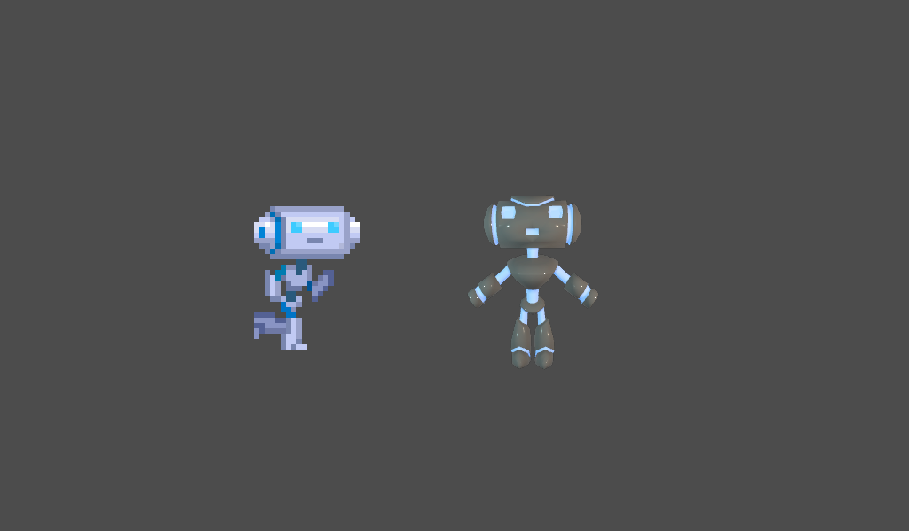

# 3D in 2D

A demo showing how a 3D scene can be shown within a 2D one using viewports.

Language: GDScript

Renderer: GLES 2

Check out this demo on the asset library: https://godotengine.org/asset-library/asset/128

## How does it work?

The 3D robot is rendered to a custom
[`Viewport`](https://docs.godotengine.org/en/latest/classes/class_viewport.html)
node rather than the main Viewport. In the code,
`get_texture()` is called on the Viewport to get a
[`ViewportTexture`](https://docs.godotengine.org/en/latest/classes/class_viewporttexture.html),
which is then assigned to the sprite's texture.

## Screenshots

