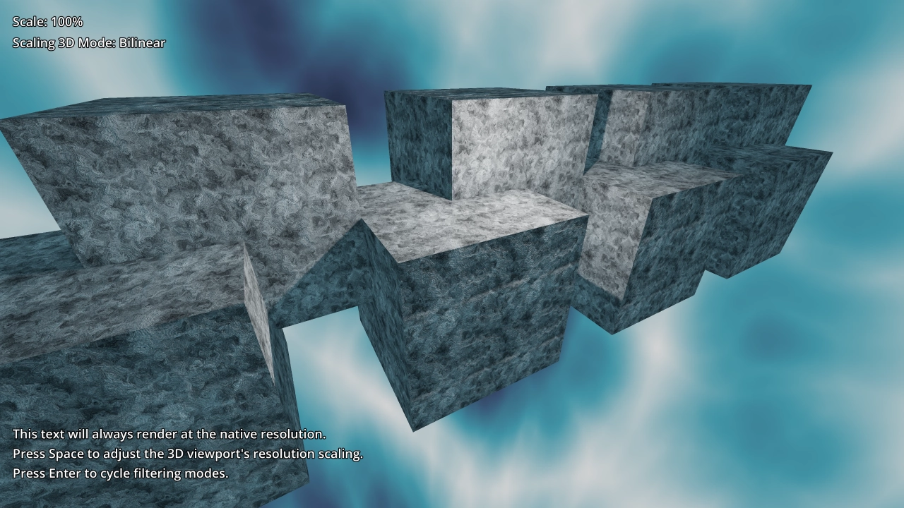

# 3D Resolution Scaling

This demo shows how to downscale the 3D resolution without affecting 2D
elements, to improve performance without making the UI blurry.

See [Resolution scaling](https://docs.godotengine.org/en/stable/tutorials/3d/resolution_scaling.html)
in the documentation for details.

Language: GDScript

Renderer: Forward+

Check out this demo on the asset library: https://godotengine.org/asset-library/asset/2805

## Screenshot

