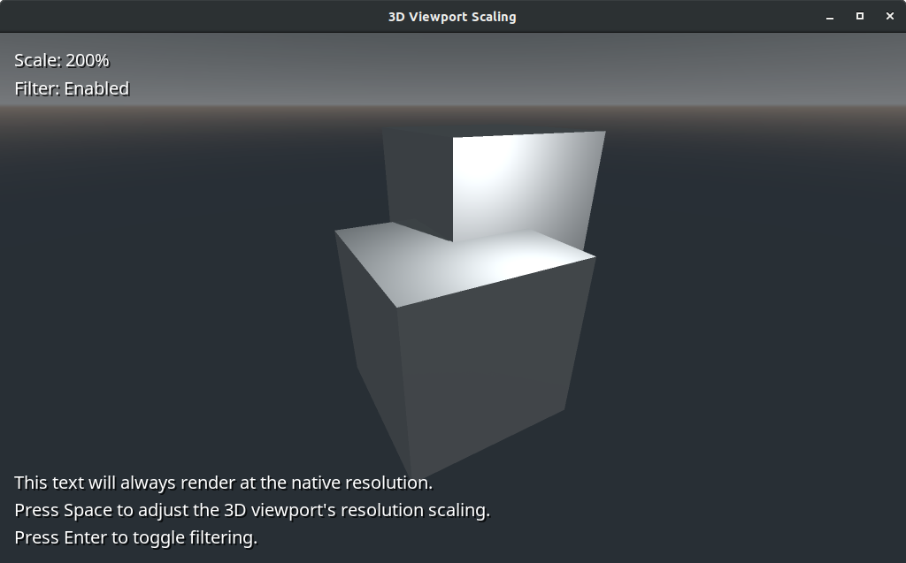
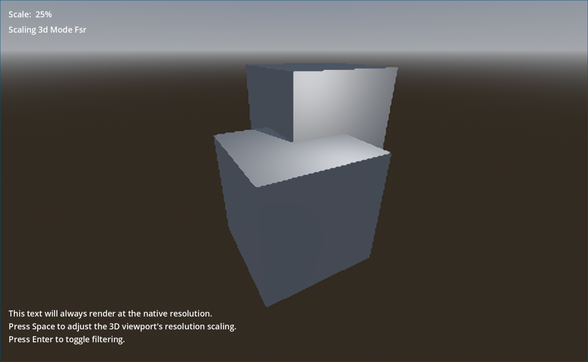

# 3D Viewport Scaling

This demo shows how to scale the 3D viewport rendering without affecting 2D
elements such as the HUD. It also demonstrates how to toggle filtering on a
viewport. This technique can be useful in 2D games as well. For instance, it can
be used to have a "pixel art" viewport for the main game area and a
non-pixel-art viewport for HUD elements.

Language: GDScript

Renderer: GLES 2

Check out this demo on the asset library: https://godotengine.org/asset-library/asset/586

## Screenshots

