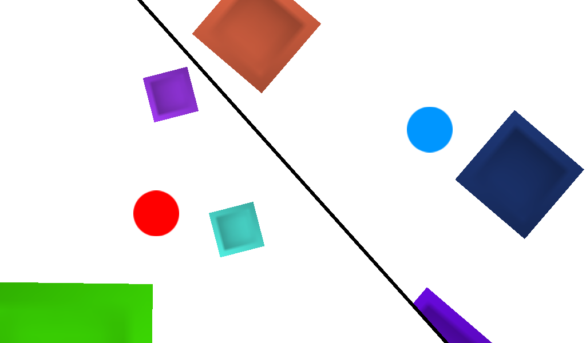
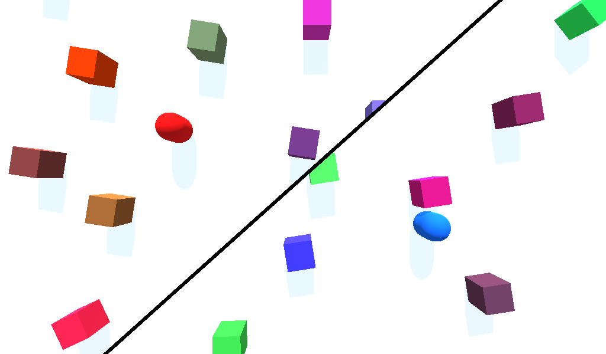

# Dynamic Split Screen

This sample project showcases an implementation of dynamic
split screen, also called Voronoi split screen, for both 2D and 3D games.

Language: [GDSL](https://docs.godotengine.org/en/latest/tutorials/shaders/shader_reference/shading_language.html) and GDScript

Renderer: GLES 2

Note: An HTML5 export is testable on [itch.io](https://benjaminnavarro.itch.io/godot-dynamic-split-screen-demo).

Check out this demo on the asset library: https://godotengine.org/asset-library/asset/541

## Details

A dynamic split screen system displays a single screen when
the two players are close but a split view when they move apart.

The splitting line can take any angle depending on the players'
position, so it won't be either vertical or horizontal.

This system was popularized by the Lego video games.

## How it works

Two cameras are placed inside two separate viewports and their
texture, as well as some other parameters, are passed to a
shader attached to a TextureRect filling the whole screen.

The `split_screen` shader, with the help of the `camera_controller`
script, chooses which texture to display on each pixel to
achieve the effect.

The cameras are placed on the segment joining the two players,
either in the middle if they're close enough or at a fixed
distance otherwise.

## How to use it

Open and launch the project inside the Godot engine, select either the
2D or the 3D demo from the menu and then use WASD/ZQSD keys
to move the first player and IJKL/arrows keys to move the
second one.

While a demo is running, you can press the escape key to get back
to the menu.

The `Cameras` node has parameters to tune the distance at
which the screen splits and also the width and color of
the splitting line. The `Adaptive Split Line Thickness` parameter
select whether the split line has a constant thickness or a dynamic
one varying depending on the distance between the two players.

## Screenshots

### 2D

### 3D

