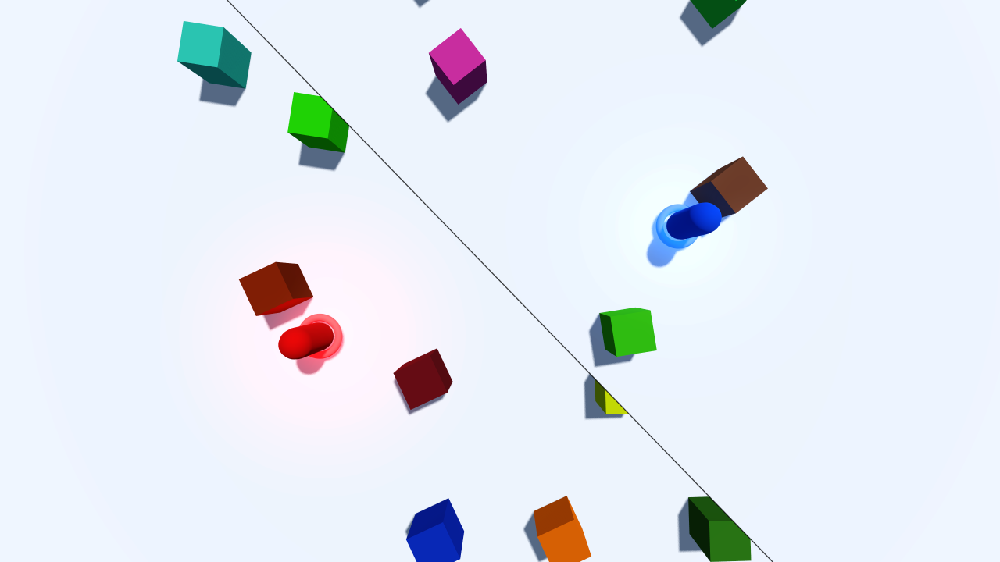

# Dynamic Split Screen

This sample project showcases an implementation of dynamic
split screen, also called Voronoi split screen.

Language: [Godot shader language](https://docs.godotengine.org/en/latest/tutorials/shaders/shader_reference/shading_language.html) and GDScript

Renderer: Compatibility

Check out this demo on the asset library: https://godotengine.org/asset-library/asset/2806

## Details

A dynamic split screen system displays a single screen when
the two players are close but a splitted view when they move apart.

The splitting line can take any angle depending on the players'
position, so it won't be either vertical or horizontal.

This system was popularized by the Lego videogames.

## How it works

Two cameras are placed inside two separate viewports and their
texture, as well as some other parameters, are passed to a
shader attached to a TextureRect filling the whole screen.

The `SplitScreen` shader, with the help of the `CameraController`
script, chooses wich texture to display on each pixel to
achieve the effect.

The cameras are placed on the segment joining the two players,
either in the middle if they're close enough or at a fixed
distance otherwise.

## How to use it

Open and launch the project inside the Godot engine, then
use WASD to move the first player (in red) and IJKL (or arrow keys)
to move the second player (in blue).

The `camera_controller.gd` script sets parameters to tune the distance at
which the screen splits and also the width and color of
the splitting line.

## Screenshots

