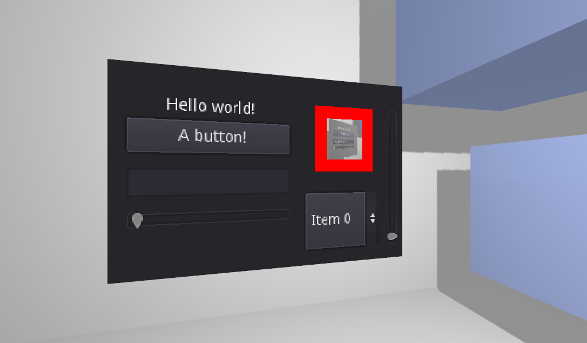

# GUI in 3D

A demo showing a GUI instanced within a 3D scene using viewports,
as well as forwarding mouse and keyboard input to the GUI.

Language: GDScript

Renderer: Compatibility

Check out this demo on the Asset Store: https://store.godotengine.org/asset/godot-foundation/gui-in-3d-demo/

## Screenshots

