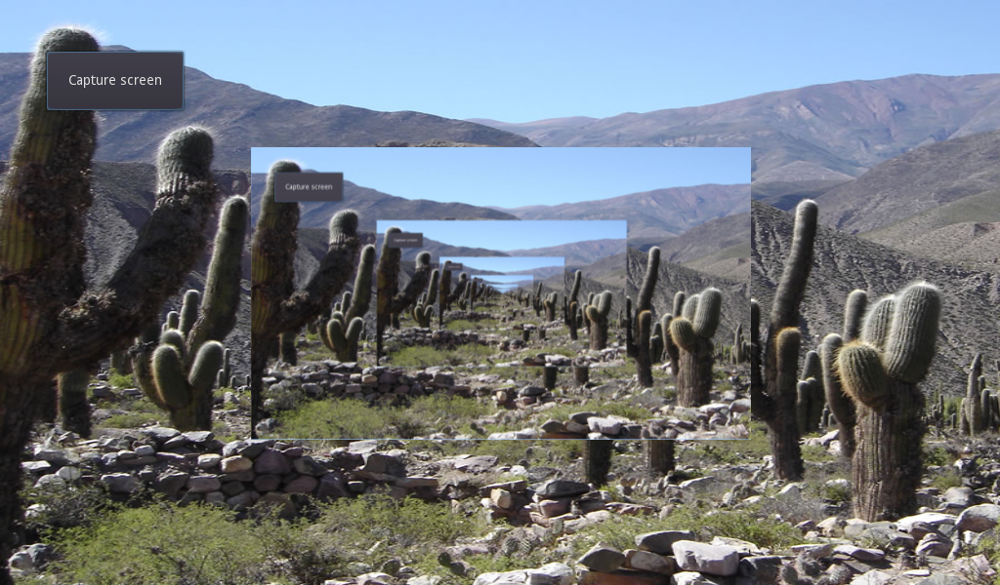

# Screen Capture

An example showing how to take screenshots of the screen.

Language: GDScript

Renderer: GLES 2

Check out this demo on the asset library: https://godotengine.org/asset-library/asset/130

## Screenshots

