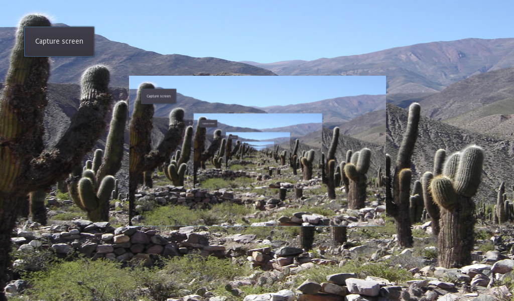

# Screen Capture

An example showing how to take screenshots of the screen.

Language: GDScript

Renderer: Compatibility

Check out this demo on the Asset Store: https://store.godotengine.org/asset/godot-foundation/screen-capture-demo/

## Screenshots

