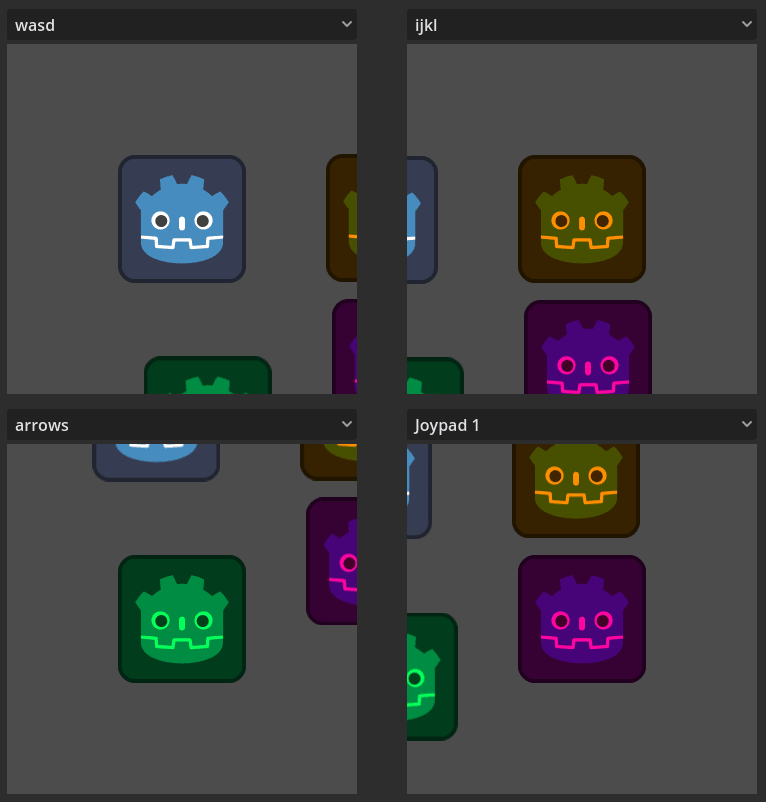

# Split Screen Input

A demo showing a Split Screen GUI and input handling for local multiplayer using viewports.

It demonstrates:
- Single World2D, that is shared among many Viewports
- Simplified Input Map, that uses the same Actions for all Split Screens
- Input event routing to different viewports based on joypad device id and dedicated keyboard keys
- Dynamic keybinding adjustment for each Split Screen

Language: GDScript

Renderer: Compatibility

## Screenshots

