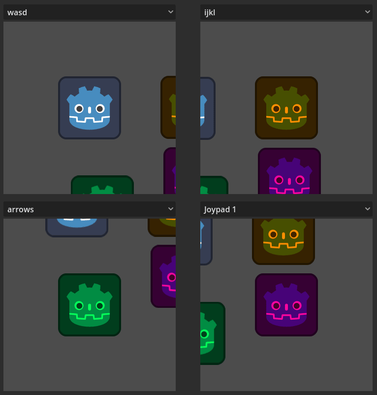

# Split Screen Input

A demo showing a Split Screen GUI and input handling for local multiplayer using viewports.

It demonstrates:

- Single World2D that is shared among many Viewports.
- Simplified input map that uses the same actions for all split screens.
- Input event routing to different viewports based on joypad device ID and dedicated keyboard keys.
- Dynamic keybinding adjustment for each split screen.

Language: GDScript

Renderer: Compatibility

Check out this demo on the Asset Store: https://store.godotengine.org/asset/godot-foundation/split-screen-input-demo/

## Screenshots

