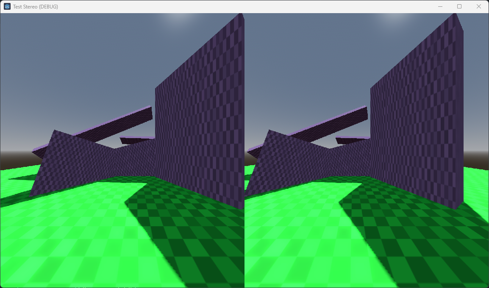

# Mobile VR interfae demo

This is a really simple demo that shows how the mobile VR interface can be enabled.
This is a great little project to test stereo rendering on desktop without needing XR hardware.
When used on mobile devices simple 3DOF headtracking can be tested.

Language: GDScript

Renderer: Compatibility, Mobile, Forward+

Check out this demo on the asset library: https://godotengine.org/asset-library/asset/0000

## How does it work?

This sample shows the simplest form for enabling and testing an XR application.
It uses the build in Mobile VR Interface.

There is simple left/right/up/down movement on desktop.

## Shortcomings

Note that currently lens distortion in the mobile VR interface is **not** supported in the compatibility renderer.

## Screenshots

