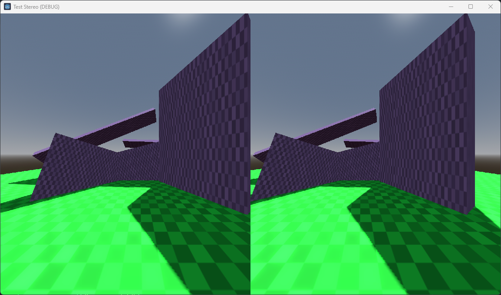

# Mobile VR Interface Demo

This is a simple demo that shows how the mobile VR interface can be enabled.
This is a small project to test stereo rendering on desktop without needing XR hardware.
When used on mobile devices, simple 3DOF headtracking can be tested.

Language: GDScript

Renderer: Compatibility, Mobile, Forward+

Check out this demo on the Asset Store: https://store.godotengine.org/asset/godot-foundation/mobile-vr-interface-demo/

## How does it work?

This sample shows the simplest form for enabling and testing an XR application.
It uses the built-in Mobile VR Interface.

There is simple left/right/up/down movement on desktop.

## Shortcomings

Note that currently, lens distortion in the mobile VR interface is **not** supported in the Compatibility renderer.

## Screenshots

