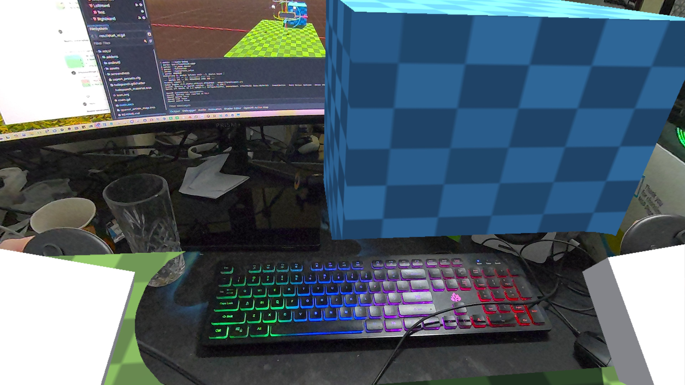

# OpenXR Passthrough Demo

This is a demo showing OpenXR's passthrough functionality.

Language: GDScript

Renderer: Compatibility

> [!NOTE]
>
> This demo requires Godot 4.5 or later

## Screenshots

## How does it work?

Passthrough is a feature available on a number of XR headsets.
It uses the cameras on the device to show the real world inside of the headset.

This demo shows how to correctly set up passthrough.
While the demo will attempt to start in passthrough mode (see the OpenXR Project settings),
there are extra steps to perform that you will find in `main.gd`.
The most important being enabling the viewport's transparent background feature.

Note that the environment is also set up to use the sky for ambient color and reflections,
even after the background has been made transparent.
While not part of this demo,
this allows for accurate light estimation in headsets that support this feature.

Finally there is an example of using the `shadow_to_opacity` feature to cut out
a box shape.
A use case for this is allowing the user to anchor that box where their keyboard
is positioned, and in doing so keeping the keyboard visible to the user.
You can only see the effect properly in headset as the editor viewport does not
enable a transparent background.

> [!IMPORTANT]
> In order to save space in this repo, the OpenXR Vendor plugin is not included
> but related settings are part of this demo!
> Please install it from the asset library first.

## Action map

This demo project has a barebones action map as we're only dealing with positioning.

## Running on PCVR

This project can be run as normal for PCVR however only a few runtimes actually support passthrough in this way.
For some you still need to install the OpenXR vendors plugin as passthrough support can rely on vendor extensions.

Ensure that an OpenXR runtime has been installed.

## Running on standalone VR

This demo works best on standalone headsets as many support passthrough.

You **must** install the Android build templates and OpenXR vendors plugin.
This project does include an `export_preset.cfg` file with example setups for some of these devices.
Please follow [the instructions for deploying on Android in the manual](https://docs.godotengine.org/en/stable/tutorials/xr/deploying_to_android.html).

