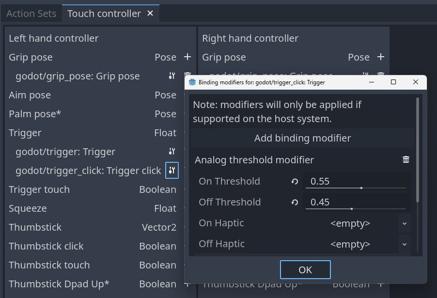
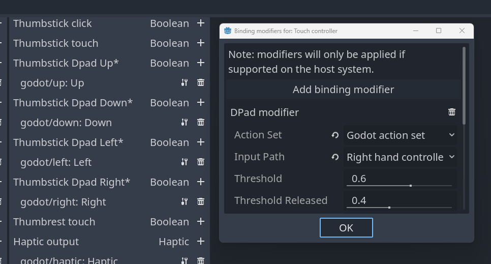
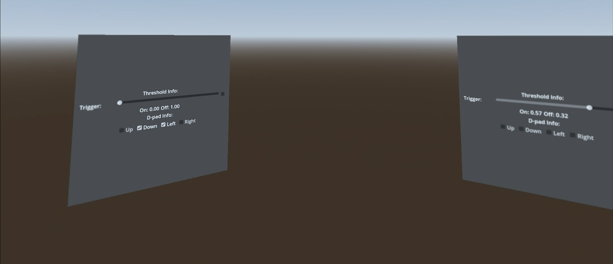

# XR Binding Modifier demo

This is a demo for an OpenXR project where we show how to use the binding modifier feature in the action map.

Language: GDScript

Renderer: Compatibility

Check out this demo on the asset library: https://godotengine.org/asset-library/asset/0000

## How does it work?

OpenXR has introduced a system called binding modifiers that allow you to add additional logic to the action map.
Currently there are only two modifiers available but more will likely be coming.

**Warning:** Binding modifiers are optional features that need to be enabled and may not be available on all platforms.

## Local Floor Reference Space

This demo uses the local floor reference space so the player is centered by default looking at the information displays.

If your player isn't standing in the correct spot, try a system recenter.
This is different per runtime, for instance:
- On Quest (including with SteamLink) hold the Meta button for 3 seconds to initiate a recenter.
- On SteamVR open the in headset SteamVR menu and choose the recenter option from the menu.

## Action map

This project does not use the default action map but instead configures an action map that just contains the actions required for this example to work. This so we remove any clutter and just focus on the functionality being demonstrated.

The actions defined in the action map are solely needed to demonstrate the different modifiers and uses the `grip_pose` to position the controllers.

### Analog Threshold Modifier

This is a modifier that works on boolean inputs that are driven by analog controls such as the trigger or grip button (on some controllers).
With this modifier you can change the default values at which the input toggles from `true` to `false` or back.

**Note:** This modifier is created on the individual bindings using the modifier button next to each binding.

### DPad Modifier

The DPad extension splits common inputs like thumbsticks and trackpads into a DPad like input.
When using the DPad inputs you should not also bind the original thumbstick or trackpad input.
Optionally you can also add a modifier to further control this behavior.

**Note:** This modifier is created for the interaction profile with the modifier button on the right hand side.

## Running on PCVR

This project can be run as normal for PCVR. Ensure that an OpenXR runtime has been installed.
This project has been tested with the Oculus client and SteamVR OpenXR runtimes.
Note that Godot currently can't run using the WMR OpenXR runtime. Install SteamVR with WMR support.

## Running on standalone VR

You must install the Android build templates and OpenXR loader plugin and configure an export template for your device.
Please follow [the instructions for deploying on Android in the manual](https://docs.godotengine.org/en/stable/tutorials/xr/deploying_to_android.html).

## Screenshots

