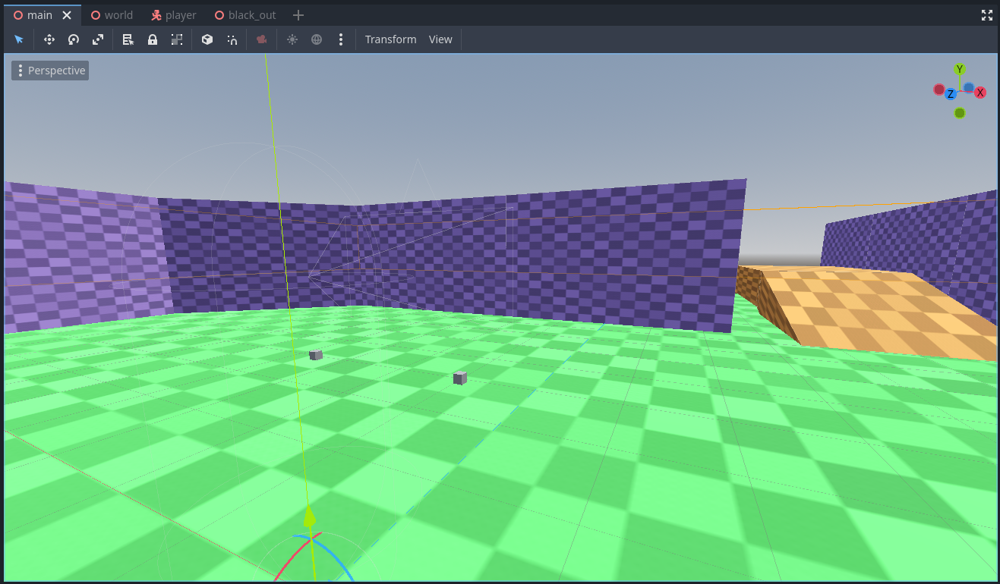

# XR Character Body Centric Movement demo

This is a demo for an OpenXR project where player movement is handled with a CharacterBody3D as a base node.
This is based on the [Character body centric solution as explained in the room scale manual page](https://docs.godotengine.org/en/stable/tutorials/xr/xr_room_scale.html#character-body-centric-solution).

Language: GDScript

Renderer: Compatibility

Check out this demo on the asset library: https://godotengine.org/asset-library/asset/2809

## How does it work?

With modern VR equipment the user is able to move around a large playspace.
This is often refered to as roomscale VR.
The position of the headset and controllers are tracked in reference to a fixed point within this playspace.
This is often a point on the ground at the center of the playspace mapped out by the user when setting up their guardian.

In Godot the center of this playspace is represented by the `XROrigin3D` node with camera and controllers being tracked through resp. `XRCamera3D` and `XRController3D` child nodes which can thus not be positioned by the user.
The misunderstandings this causes in handling player movement is described in detail in [the XR room scale manual page](https://docs.godotengine.org/en/stable/tutorials/xr/xr_room_scale.html), a highly recommended read before continuing with this demo.

This demo implements the character body centric solution to the player movement problem.
Virtual movement by the player (e.g. movement through controller input) in this demo is handled similarly to a non-XR Godot game.
Physical movement by the player will result in the character body attempting to move to the players new location.
If successful the XROrigin node is moved in the opposite direction of the players movement.
If unsuccessful the character body stays behind, the further the player moves the more we black out the screen.

## Action map

This project does not use the default action map but instead configures an action map that just contains the actions required for this example to work. This so we remove any clutter and just focus on the functionality being demonstrated.

There are only two actions needed for this example:
- aim_pose is used to position the XR controllers
- move is used as the input for our movement

"Move" being the hero here. This action is only bound to one of the two controllers, by default making it a right hand option. Godot will always associate the move action with the controller that is bound to it.

The code example assumes either controller could trigger the move action. Switching from right to left hand is a separate topic out of scope of this demonstration.

Also following OpenXR guidelines only bindings for controllers with which the project has been tested are supplied. XR Runtimes should provide proper re-mapping however not all follow this guideline. You may need to add a binding for the platform you are using to the action map.

## Running on PCVR

This project can be run as normal for PCVR. Ensure that an OpenXR runtime has been installed.
This project has been tested with the Oculus client and SteamVR OpenXR runtimes.
Note that Godot currently can't run using the WMR OpenXR runtime. Install SteamVR with WMR support.

## Running on standalone VR

You must install the Android build templates and OpenXR loader plugin and configure an export template for your device.
Please follow [the instructions for deploying on Android in the manual](https://docs.godotengine.org/en/stable/tutorials/xr/deploying_to_android.html).

## Screenshots

