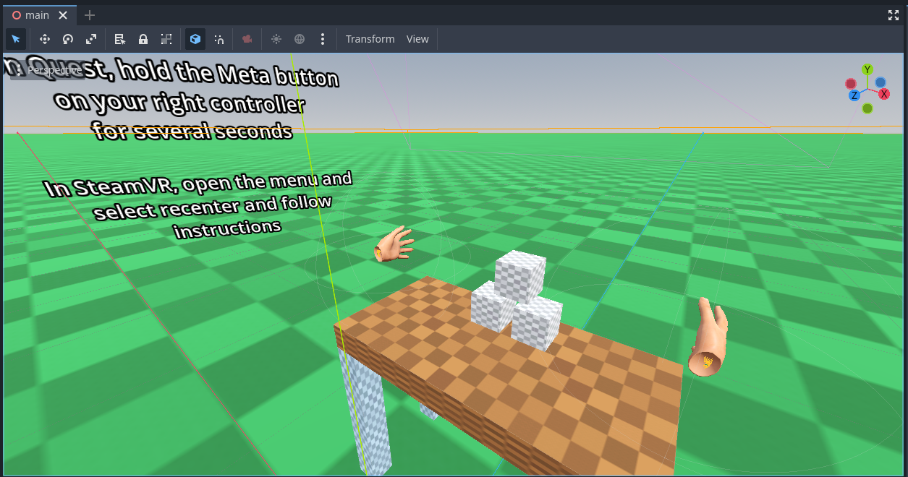

# XR Hand Tracking Demo

This is a demo showing OpenXRs hand tracking and controller tracking logic.

Language: GDScript

Renderer: Compatibility

> Note: this demo requires Godot 4.3 or later

## Screenshots

## How does it work?

Being able to see the players hands, and having those hands interact with elements in the environment are paramount to a good XR experience.

In this demo we look at the off the shelf logic for displaying a hand model that is automated based on either controller input or through optical tracking of the players hands.
We also implement logic that allows interaction based on input from the action map that allows the user to pick up the blocks in this demo.

The problem this poses to us is that there have been two schools of thought around what hand tracking actually means,
and depending on the XR runtime in use there may be gaps in functionality.

### Hand tracking is only for optical tracking

The first school of thought treats hand tracking as a separate system that purely focusses on optical hand tracking.
The hand tracking API in OpenXR, even if reported as supported, will only provide data if optical hand tracking is used.

This means that when controllers are used, no data is available and you as a developer have to come up with your own
solution for displaying a hand mesh and animating it according to controller input.
Note that the current version of Godot XR Tools contains a full solution for this.

Equally in this line of thought, the action map is only applicable to controller input.
You as a developer are responsible for implementing some means of gesture recognition when optical hand tracking is active.

This becomes extra nightmarish when support for both controller tracking and optical hand tracking needs to be supported in a single application.

### The unified approach

The second school of thought ignores the differences between controller tracking and optical hand tracking
and treats them as two versions of the same.
Especially with controllers like the Valve Index, or with various data gloves that are treated as controllers,
there is no discernible difference here.

The hand tracking API is mostly used for visualising the players hand with bone positions either being inferred
from controller input or matching the optical tracking.
For advanced gesture recognition you would still use this data however it is now accessible regardless of
the physical means in which this data is obtained.

At the same time, in this school of thought the action map system is seen as the primary means to gain input
and is no longer restriced to input from controllers. The XR runtime is now responsible for recognising base
gestures such as pinching and pointing resulting in inputs that can be bound in the action map.

OpenXR is moving towards this approach and this demo has been build in accordance with this however not all runtimes have been updated yet.

SteamVR has followed this approach for a long time and works out of the box, however SteamVR treats everything as controllers resulting in some short comings when a Quest is used over Meta Link or Steam Link and optical hand tracking is used.

Metas native Quest runtime on all versions of Quest now support OpenXRs "data source extension" which Godot enables when hand tracking is enabled.
However Meta does not yet support OpenXRs "hand interaction profile extension" which is required.

Meta link is still trailing behind and does not support this brave new world **yet**.

For other runtimes like Picos, HTC, Varjos, Magic Leaps, etc. may or may not yet support the required extensions.

### Conclusion

Due to the wildgrowth in capabilities in XR runtimes,
and there being no solid way to detect the full limitations of the platform you are currently on,
Godot XR Tools does not have support for the hand tracking API and purely relies on its own inferred hand positioning approach.

However with more and more runtimes adopting these new extensions any solution that targets platforms with support,
it is becoming possible to rely on the hand tracking API.

This demo project shows what that future looks like.

## Hand tracking API

As mentioned, the hand tracking API is at the center of visualising the users hand.
In Godot 4.3 we overhauled the system so the XR Interface needs to convert hand tracking data to the Godot humanoid skeleton hand bone layout.
This also means that this logic works both in WebXR, OpenXR and any other XR Interface that adds support for this feature.

Hand tracking now also makes use of the new Skeleton Modifier logic in Godot 4.3 however
the skeleton is posed in the hands local space, while positioning is provided through a XRNode3D node.

This split is applied because:

* positioning is always within the local space of the XROrigin3D node
* there are many use cases where the positioning may be ignored or modified

> Note that the trackers used for the hand tracking API are `/user/hand_tracker/left` and `/user/hand_tracker/right`.

## (Half) body Tracking API

Just an honerable mention of this, this is not part of this demo but Godot now also has support
for half and full body tracking that includes hand tracking. This functionality however is only
available on a limited number of XR runtimes.

## Action map

As mentioned, we're using the action map here for input however when optical hand tracking is used
we rely on OpenXRs hand interaction profile extension. Without support for this extension this demo
will not fully function.

This can be solved by checking that no interaction profile has been bound to our XRController3D node,
and performing our own gesture detection.
As this would greatly increase the complexity of this demo and the expectation is that this extension
will soon see wide adoption, this is left out of the demo.

> Some headsets will support the simple controller when hand tracking is enabled.
> The simple controller interaction profile doesn't support an input for grabbing.
> In this scenario you can grab the cubes using the pinch gesture
> (touch the tip of your thumb with the tip of our index finger).

We are not using the default action map and instead have created an action map specific to this use case.

There are only two actions needed for this example:
- `pose` is used to position the XRController3D nodes and mapped to the grip pose in most cases
- `pickup` is used as the input for picking up an object, and mapped accordingly.

The pickup logic itself is split into two components:

* `pickup_handler.gd/.tscn` is an Area3D node with logic that is added as a child to an XRController3D node and handles the logic for that hand to pick up objects in range.
* `pickup_able_body.gd` is a script that can be added to a RigidBody3D node to make it possible to pick up/drop that object.

> Note that the trackers used by the action map are `left_hand` and `right_hand`.

### MSFT Hand interaction extension

Microsoft introduced a hand interaction extension that Godot now supports and is configured for this project.
Several other vendors such as Meta have added support for this extension as well.

With this extension both grab gestures and pinch gestures are supported and you can thus pick up the blocks in this project by making a grab motion (making a fist).

### HTC Hand interaction extension

HTC introduced a hand interaction extension that Godot now support however this has not been implemented in this project.
This extension introduces two new trackers requiring you to change the trackers on the XRController3D node to make this work.

## Local floor reference space

A final notable element is that this demo uses the local floor reference space.

With this reference space the XR runtime will center the player on the XROrigin3D node when the user triggers the recenter logic.
The startup behavior is different between different XR runtimes, Quest will attempt to remember where you recentered last, while SteamVR tends to reset this to default.
It can thus not be guaranteed the player is in the correct spot when the demo starts.
Hence the instructions suggesting the user recenters.

## Running on PCVR

This project can be run as normal for PCVR. Ensure that an OpenXR runtime has been installed.
This project has been tested with the Oculus client and SteamVR OpenXR runtimes.
Note that Godot currently can't run using the WMR OpenXR runtime. Install SteamVR with WMR support.

## Running on standalone VR

You must install the Android build templates and OpenXR loader plugin and configure an export template for your device.
Please follow [the instructions for deploying on Android in the manual](https://docs.godotengine.org/en/stable/tutorials/xr/deploying_to_android.html).

