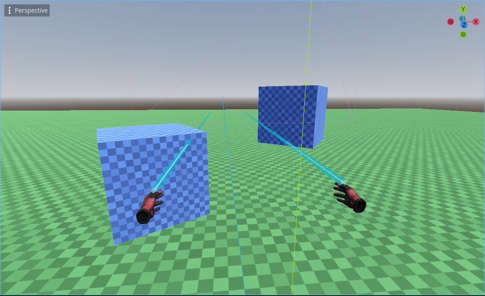

# OpenXR hand tracking demo

This demo is an OpenXR project that demonstrates how to use the hand tracking extension and the hand interaction profile extension.
These extensions can be used separately however used together the compliment eachother incredibly well.

Godot version: 4.2.0
Language: GDScript
Renderer: compatibility

## How does it work?

Hand tracking in OpenXR has been a somewhat divisive subject over the years as there have been differences in platform implementation. Since OpenXR 1.0.28 things have started to come together and as support for new extension increases we're getting a more holistic approach.

There are two sides to hand tracking, each serviced by different APIs.

### Hand visualisation

The ability to accurately visualise the hand of the user, with accurate positioning of fingers, is important to the feeling of emersion in XR.

In the early days of XR, tracking was limited to controllers held by the user, visualising the users hand was accomplished by attaching a hand model to the controller model and animating the fingers based on which buttons were pressed on the controller. This later was improved by additional sensors on the controller to further improve positioning of fingers. In earlier VR APIs this was put in the hands of the developer however this has become increasingly more difficult with OpenXR as access to the sensor is often not possible.

With the advant of optical hand tracking, where full information about finger orientation became possible, a new and more accurate way of visualising the users hand became possible. For this OpenXR added the hand tracking extensions, which provides an API to obtain the position and orientation of all joints of the users hand. This in turn allows the creation of a bone armature that can be applied to a skinned hand.
This demo uses this API to visualise the users hand by making use of the `OpenXRHand` helper node that is part of the OpenXR module.

As haptic gloves are slowly introduced into the market we see devices that cross/merge the controller and hand tracking paradigm. This will likely lead to further developments on this functionality.

**Warning** XR runtimes that allow optical hand tracking until recently treated this as separate to controller tracking and the hand tracking extension would only function when optical hand tracking was used. This resulted in a problem when the user switched between controller and optical hand tracking. Only SteamVR provided inferred hand tracking as standard providing a seamless transition between the two. Recently the [Hand tracking data source](https://registry.khronos.org/OpenXR/specs/1.0/html/xrspec.html#XR_EXT_hand_tracking_data_source) extension was added. Once Godot supports this extension and more runtimes implement this, we will update this demo with support for this.

**Note** XR runtimes that perform optical hand tracking will often adjust the bone information to conform fully to the users hand, while runtimes that infer hand tracking from controller input will use a fixed armature. This can lead to deformation issues when a hand model is incorrectly skinned and the bone data results in a much smaller, or larger armature than the model was based on. Be sure to test your hand models with a wide variaty of devices and XR runtimes!

### Hand interaction

OpenXR from its inception used an action map to handle interacting with the virtual world however the action map was always limited to controller based systems.

When optical hand tracking was introduced, only joint data could be retrieved through the aforementioned API. This meant that a disjoint was introduced between user interaction when controllers were used, and interaction when optical hand tracking was used with the latter requiring the user to implement their own strategies for detecting gestures that triggered actions.

OpenXR 1.0.28 introduced the [Hand interaction extension](https://registry.khronos.org/OpenXR/specs/1.0/html/xrspec.html#XR_EXT_hand_interaction) which adds support to the action map for basic gesture recognition. This is what we use in this demo.

This extension has two ways of being used:

First, you can add the new interaction profile to an existing action map, normal controller profiles will be used for controllers and OpenXR will switch to the hand interaction profile after we switch to optical hand tracking.

Second, you can setup an action map that only contains the hand interaction profile. The extension guarantees that if controllers are used, all inputs are emulated.

## Action map

This demo contains a custom action map tailered to this demo. It is fully based on the hand interaction profile approach and will thus only function if the hand interaction extension is available.

## Running on PCVR

This project can be run as normal for PCVR. Ensure that an OpenXR runtime has been installed.
This project has been tested with the SteamVR OpenXR runtime.
The Oculus desktop runtime currently doesn't support hand tracking.

Note that Godot currently can't run using the WMR OpenXR runtime. Install SteamVR with WMR support.

## Running on standalone VR

This project is preconfigured for export to Quest however you must install the Android build templates and OpenXR loader plugin.
Please follow [the instructions for deploying on Android in the manual](https://docs.godotengine.org/en/latest/tutorials/xr/deploying_to_android.html).

## Screenshots

