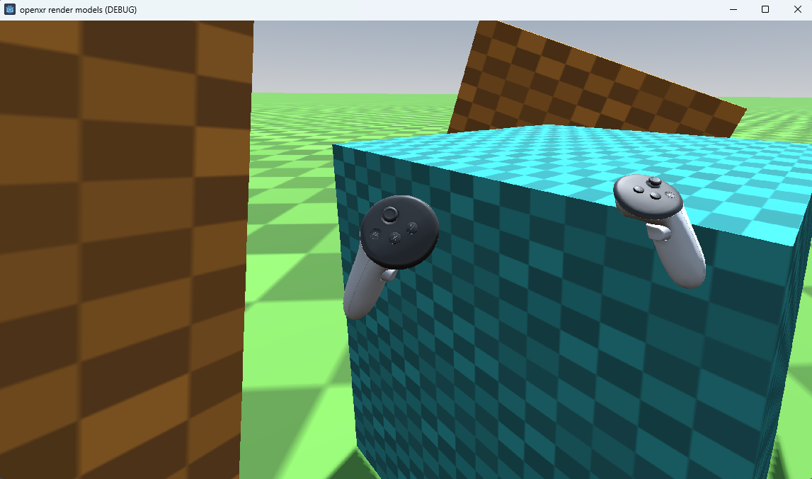

# OpenXR Render models demo

This is a demo showing OpenXR's render models implementation.

Language: GDScript

Renderer: Compatibility

> [!NOTE]
>
> This demo requires Godot 4.5 or later

## Screenshots

## How does it work?

OpenXR allows us to run our application without having knowledge of the hardware being used,
or that we as developers have access too at the time of developing our application.

As a result we don't have direct information telling us what hardware is being used,
however there are situations where we want to visually show this hardware.

This specifically applies to the controllers used by the user, as showing the correct hardware
improves the user's sense of immersion.

The render model API allows us to enumerate the devices currently in use and then query
information such as its 3D asset, its position and orientation in space, and the position
and orientation of individual components of the asset.

Godot's implementation hides most of the complexity of this through the OpenXRRenderModelManager
node as a child of the XROrigin3D node. You can add just this node by itself and let it show
all render models that are currently active, or like we do in this demo, you can add nodes
in the tree of each controller to show render models related to that controller.

## Action map

This demo project has a barebones action map as we're only dealing with positioning.

## Running on PCVR

This project can be run as normal for PCVR. Ensure that an OpenXR runtime has been installed.

## Running on standalone VR

You must install the Android build templates and OpenXR loader plugin and configure an export template for your device.
Please follow [the instructions for deploying on Android in the manual](https://docs.godotengine.org/en/stable/tutorials/xr/deploying_to_android.html).

