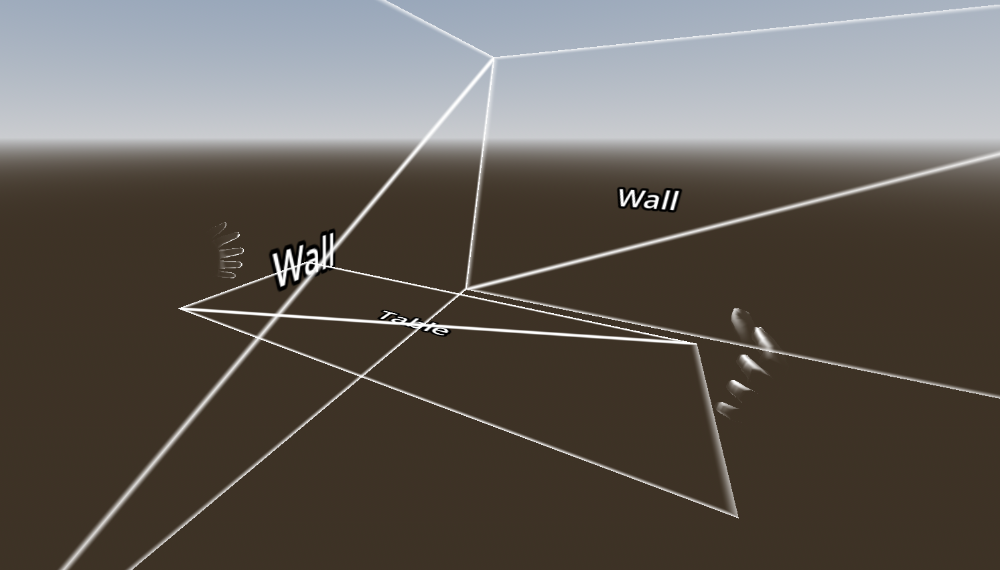

# OpenXR Spatial entity plane tracking demo

This is a demo showing OpenXR's spatial entity plane tracking implementation.

Language: GDScript

Renderer: Mobile

> [!NOTE]
>
> This demo requires Godot 4.7 or later

## Screenshots

## How does it work?

As part of OpenXR's spatial entities APIs, plane tracking allows the device to detect surfaces such as walls, floors, ceilings, and tables.
When enabled, plane tracking will register `OpenXRPlaneTracker` objects with the XRServer.
These can be used to create geometry within the scene tree to visualize the surfaces.

This project contains a `SpatialEntitiesManager` class that implements the spatial manager solution as described in [the Godot manual](https://docs.godotengine.org/en/stable/tutorials/xr/openxr_spatial_entities.html#creating-our-spatial-manager).
The manager handles detecting new trackers and instancing the correct child scenes in response.

Geometry for planes is presented both as a static colider as well as a mesh.
Both are optional and handled by the `spatial_entities_plane_tracker` implementation.
The mesh is added so a "hole punch" shader can be applied,
this will result in the geometry becoming occluding so we can occlude virtual geometry behind real world geometry.
The material has a "next" material to visualize it, this is for demo purposes only.

## Action map

This demo project does not make use of the action map.

## Running on PCVR

This project can be run as normal for PCVR. Ensure that an OpenXR runtime has been installed.

## Running on standalone VR

You must install the Android build templates and OpenXR loader plugin and configure an export template for your device.
Please follow [the instructions for deploying on Android in the manual](https://docs.godotengine.org/en/stable/tutorials/xr/deploying_to_android.html).

