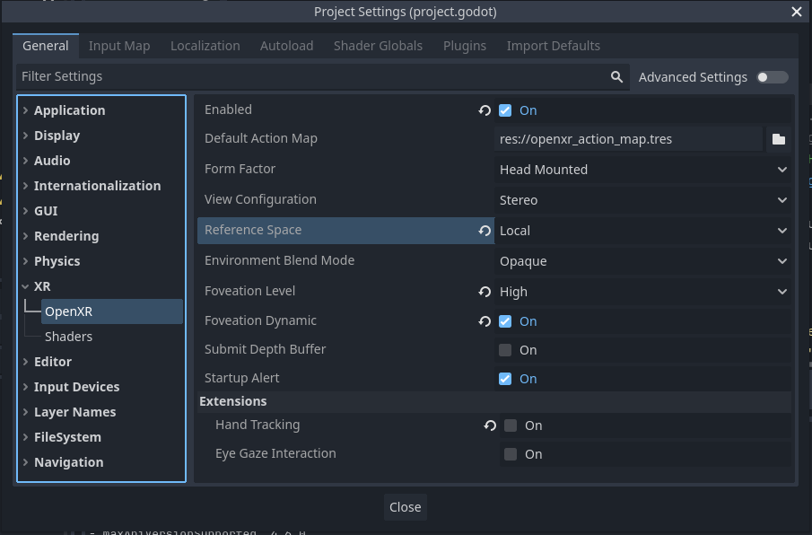
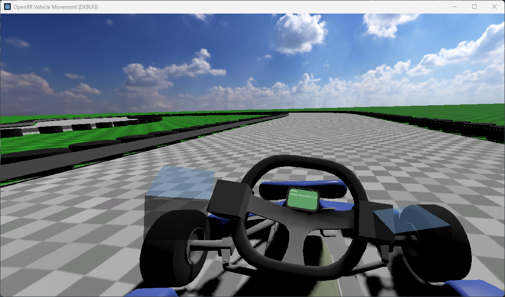

# XR Vehicle Movement demo

This is a demo for an OpenXR project where the player is positioned in a vehicle.

Godot version: 4.2.x

Language: GDScript

Renderer: compatibility

## How does it work?

Controlling a vehicle in VR is a bit of a special case.
Modern VR setups are all about freely walking around your room.
With vehicles however your player is confined in a small space, and you want to ensure the player isn't standing up in their virtual seat.
You do want the player to have some freedom of motion so they can easily look around.

There are two ways to ensure the player is in the right spot.

The first is calling [XRServer.center_on_hmd](https://docs.godotengine.org/en/stable/classes/class_xrserver.html#class-xrserver-method-center-on-hmd) with `rotation_mode` set to `XRServer.RESET_BUT_KEEP_TILT` and `keep_height` set to false. This will place the `XRCamera3D` node at the center of your `XROrigin3D` node and allows you to place the origin node where the players head should be. You use this while keeping the reference space set to the default `Stage` mode.
You will need to react to the [pose_recentered](https://docs.godotengine.org/en/stable/classes/class_openxrinterface.html#signals) signal when the user requests to recenter themselves.
This approach is useful when you switch between driving a vehicle and freely walking around. You can use `center_on_hmd` with `keep_height` set to true to switch back to roomscale mode.

The second option we use in this demo, here we leave it up to the XR runtime to handle centering our headset. To enable this we simply set the OpenXR reference space to `Local`:

In this mode the headset will use the players head position as the center of the tracking space.
Behavior can be slighly different between different XR runtimes, some will take the position at game start, others will remember the position accross gaming sessions.
When the user triggers a recenter this is automatically handled by the headset. We do still get at `pose_recentered` signal but do not need to react to it.

The second option is preferable for games that only work in this mode.

## Input and the action map

This demo uses Godots standard input map to allow for keyboard and gamepad input.

There is also an action map setup so you can use the XR controllers.
Move your hands close enough to the steering wheel so they grab the wheel,
this will disable traditional input and enable you to control the steering wheel with your hands.
You can then use the trigger on the left controller to accellerate, and the trigger on the right controller to break.

The way the steering works in XR mode is that we take the position of the hands in the local space of the steering wheel.
We then get the vector from the left hand to the right hand.
If only one controller is used we take the vector relative to the center of the steering wheel.
Now we simply calculate the angle of that vector to get our steering angle.

## Running on PCVR

This project can be run as normal for PCVR. Ensure that an OpenXR runtime has been installed.
This project has been tested with the Oculus client and SteamVR OpenXR runtimes.
Note that Godot currently can't run using the WMR OpenXR runtime. Install SteamVR with WMR support.

## Running on standalone VR

You must install the Android build templates and OpenXR loader plugin and configure an export template for your device.
Please follow [the instructions for deploying on Android in the manual](https://docs.godotengine.org/en/stable/tutorials/xr/deploying_to_android.html).

## Additional licenses

See license files in the asset subfolder for any assets that have additional licenses.

## Screenshots

